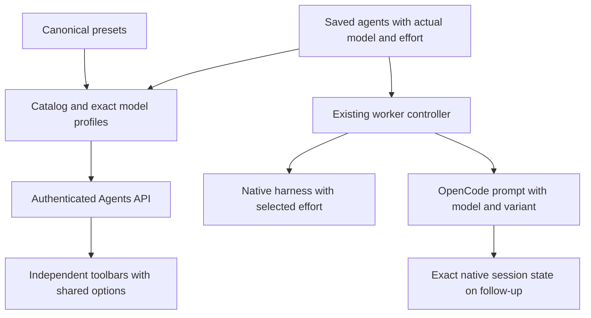

# Coherent agent catalog and roster browsing

## Overview

Make Your agents and Agent library useful for choosing an agent: independent search,
category and grouping controls with identical options; visible practical descriptions; and retained
catalog entries with an Already added state. Lead and PM are recommendations
only. Add the missing low/medium Astra and Fable choices on compatible harnesses,
and ensure the running worker receives the selected effort.

Pygmalion keeps the Codex login and is presented as Codex Images. Its underlying
image model is controlled by Codex; this work does not claim a GPT Image 2.5
upgrade. Pi Fable uses OpenRouter, as Gabriel confirmed, and identifies API usage.

Twenty feature phases, 42 tasks (twenty-one TEST/IMPL pairs). The first 16 tasks shipped
locally in alpha.46. Gabriel requested independent controls and combined model/
reasoning grouping on 2026-09-10; independent controls are installed locally as alpha.47. Gabriel has now requested
Remove beside Already added and separate top-level Your agents / Agent library screens; these additions are installed locally as alpha.48. Research: [architecture and transport](research-01.md),
[models and image route](research-02.md), [confirmed choices](interview-01.md).

## Acceptance criteria

- [x] Kimi K3 uses explicit Max in the library; Low/High/Max reach the real Kimi
  child through its supported environment control and display/group correctly.
  Existing saved settings change only through Edit or Update. Remove K2.7 Code
  and Highspeed from all active presets/labels and any saved copies. Missing
  K3 effort is labeled Kimi setting; no invented numeric levels.
  Reject invalid native model/effort pairs, preserve user config/credentials,
  and rebuild/reinstall after Node, browser and real-CLI loopback verification.

- [x] Gemini 3.1 Pro Preview and its Helios/Heimdall presets are absent from
  active catalog/CLI definitions, display metadata and saved agents. Preserve
  other models and historical transcripts.
- [x] Audit missing AA scores and verify Muse Contributor identity against
  current primary sources. Apply only verified model aliases; preserve execution
  model IDs, route differences and honest benchmark configuration labels.

- [x] Both screens open with shared Model and reasoning cards immediately;
  Clear filters restores that same default. None and Harness remain optional.

- [x] Model and reasoning groups render one shared model card in both screens:
  readable model/effort heading, common category pills, Good for description,
  benchmark scores/details once, then per-agent callsign, harness, provider route
  and individual Add/Already added/Remove or Edit/Remove actions. Other grouping
  modes retain full rows. No model/effort identity or persisted configuration changes.
- [x] Share only metadata identical across all displayed rows. Differences stay
  visible per agent; never mislabel a provider's scores or role recommendations.
  Saved descriptions, commands, drift warnings, editors/drafts, multi-copy remove
  identity, filters and score sorting survive regrouping and refresh. Single-row
  groups, images, missing scores, and narrow/light/dark layouts remain usable.


- [x] Both screens show AA score pills with source, exact tested setting, date,
  version and explanations; independently sort available metrics numerically,
  with missing scores last and hallucinations lowest first. Free access exposes
  Intelligence/Coding/Agentic only. Approved model-level scores visibly state
  when AA has not specified reasoning. All 14 supported metrics have readable
  definitions; no borrowed Ultra/default/snapshot scores or image-model guesses.
- [x] User key stays in a private 0600 local file; authenticated requests run in
  the backend. Daily disk/in-memory caching, full pagination and failure/quota
  backoff work. Matching score snapshots persist in agents.json without secrets.
- [x] Sol Low/Medium is available on Codex, Pi and OpenCode (six distinct entries,
  102 total). Lead/PM tags require Xhigh or above on Astra/Fable/Opus/Sol.
  Reviewer / second opinion tags start at Medium on known compatible coding
  models; both category filters and persisted profiles follow the same policy.
- [x] Alpha.50 rebuilt/reinstalled with all current user configurations and
  sessions preserved. No custom benchmark or proposal. Key and live AA data are
  excluded from the distributed bundle and repository.


- [x] Every browsing mode in both screens uses model capability order, then
  Ultra, Max, Xhigh, High, Medium, Low, Minimal, Off, Default, Not applicable;
  unrecognized effort comes last. Name is only a tie-breaker. None means no
  headings, not alphabetical sorting. Model and reasoning group headings follow
  the same order; Harness retains its current outer group order.
- [x] Claude families follow Fable, Opus, Sonnet, Haiku; GPT families follow Astra,
  Sol, Terra, Luna. Other catalog model variants use an explicit family/tier order
  with stable version/identity tie-breaks, preserving distinct provider snapshots.
  Gabriel confirmed family blocks: Claude, GPT, Gemini together first and
  the remaining text families alphabetically, then images and unknown models.
  This is a curated display policy, not a claim of a universal benchmark score.
- [x] Each agent displays its persisted categories as individual, readable pills
  in both screens. Keep provider route separate; pills are labels, not controls.
  Categories refresh after edits and filtering; low-effort and unknown custom
  models never inherit lead/PM pills from stale preset provenance. Wrap at narrow
  widths, with text contrast at least 4.5:1 in both themes.

- [x] Your agents and Agent library are separate top-level screens with adjacent
  header buttons. Each page contains only its own list and toolbar; custom-agent
  creation/editing lives in Your agents. Reopening preserves filters and drafts
  while reflecting saved-agent changes from the other screen.

- [x] Your agents and Agent library each have their own search, category and
  grouping controls with the same options; changes and resets affect only that list.
- [x] Group by offers None, Harness, and Model and reasoning. Model and reasoning
  groups use an exact model/effort pair across harnesses. Harness headings appear
  only when Harness is selected; the optional None view has no group headings; Model and reasoning is the default.
  Custom models, images and unspecified effort retain their correct identities.
- [x] Model and reasoning grouping places Max before Xhigh, as Gabriel clarified.
- [x] Coding, Recommended lead, Recommended PM and Images filters work;
  recommendations never change permissions, role instructions or launch flows.
- [x] Every curated entry has a readable model name and visible Good for text;
  saved custom descriptions survive reads, filtering and installation unchanged.
- [x] Added, renamed and edited preset copies show Already added with an adjacent
  Remove action in Agent library. Removing deletes only the selected saved agent,
  keeps the catalog entry, and preserves both toolbars. Multiple saved copies
  have named Remove buttons; unrelated name collisions never expose Remove.
  Failed removal keeps the saved row and reports the error; pending removal
  cannot submit twice from the same screen.
- [x] Astra low/medium exists on Codex, Pi and OpenCode; Fable 5.1 low/medium
  exists on Claude Code, Pi/OpenRouter and OpenCode/OpenRouter, with stable names.
- [x] Selected effort reaches actual worker startup. OpenCode follow-ups retain
  the exact native session model/variant even after editing the saved agent.
- [x] Pygmalion uses the existing Codex login, has no reasoning effort control,
  and no longer claims an unobserved exact image model in current display/results.
- [x] Browser checks cover both lists, mutations, error states, keyboard access
  and light/dark narrow layouts. Agent browsing remains usable without an external ranking service; scores use the optional cached AA integration.
- [x] Relevant checks pass and the corrected app is rebuilt, reinstalled and
  verified, preserving current saved agents and sessions. Do not restore the
  previously deleted agents.json or delete agents added since then. Newly added
  agents continue saving complete display profiles. Published alpha.43 is unaffected.

## Product behavior

### Independent browsing

Your agents and Agent library are separate top-level screens with adjacent header
buttons. Your agents at / contains saved agents and custom-agent creation; Agent
library at /library contains all ready-made choices. Each has a toolbar under its heading. Both use the
same search, Category, Group by and Clear filters controls, but their state is
independent. Changing or clearing one toolbar never changes the other list.

```text
Your agents                         5 of 12 shown
[ Search agents…                         ]
Category [ All categories ]   Group by [ Model and reasoning ]   [ Clear filters ]
GPT-6 Astra · Low · 1
[common category pills, description and scores]
electra       Codex · Codex login                 Edit  Remove

Agent library                         24 of 102 shown
[ Search agents…                         ]
Category [ All categories ]   Group by [ Model and reasoning ]   [ Clear filters ]
GPT-6 Astra · Medium · 3
[common category pills, description and scores]
maia          Codex · Codex login            Already added  Remove
merope        Pi · Codex subscription                         Add
skirnir       OpenCode · OpenRouter API                      Add
```

Each list defaults to empty search, All categories and Model and reasoning grouping. Search
matches callsign, model name/ID, harness, provider route, effort, description and
recommendation labels. Category and search intersect. Clear filters resets only
its own list. Preserve both toolbars across add/remove/edit/sync refreshes and
closing/reopening each retained iframe; no persistent browsing preference needed.
Agent display profiles remain saved in the existing roster document.

Group by has exactly None, Harness, and Model and reasoning. None displays one
flat model-capability/descending-effort list without group headings. Harness uses Claude Code, Codex,
OpenCode, Pi, Kimi, Images, then unknown harnesses alphabetically. There is no
permanent harness split or harness subgroup under another grouping.

Model and reasoning groups use the exact canonical model key plus effective
effort; compatible aliases on different harnesses share the same group only when
both match. Show the readable model and effort in its heading, followed by count.
Sort groups by the confirmed family/tier policy, then reasoning order: Ultra, Max,
Xhigh, High, Medium, Low, Minimal, Off, Default, Not applicable, then custom values alphabetically.
Missing text-agent effort uses Default; inherited Kimi effort uses Kimi setting; images use Not applicable.
Within Harness groups sort by model then effort/callsign; within model/effort
groups sort by callsign, with no harness subdivision.

Section counts count filtered entries out of the full list, including Already
added. Empty roster and no matches remain distinct. Expose each list as a named
region so control labels have clear context for accessibility/tests.

Reuse the current marine palette, Archivo/system UI font and IBM Plex Mono
utility font. Keep compact rows, visible Good for text and existing editing
actions. At narrow widths, stack controls and wrap metadata without horizontal
page overflow. Labels, focus outlines and disabled buttons remain accessible;
no tooltip-only descriptions or new animation/dependency is needed.

### Categories and descriptions

Use a single presentation profile helper in `hosts/lib/presets.js`, shared by
manager and engine persistence and re-exported through `src/catalog.js`, sourced from
canonical presets and exact model aliases. Both API roster rows and catalog
entries receive `profile: { modelKey, modelLabel, routeLabel, categories, goodFor }`.
These fields are persisted under each row's `profile`, refreshed from its actual
model/effort on writes and a bounded metadata refresh for existing rows. They are
not copied into custom descriptions or used to authorize roles. Artificial Analysis snapshots extend profiles as specified below; no inferred prices or scores.

Categories overlap: Coding for known coding-harness entries; Images for image
entries; Recommended lead/PM are additional curated tags. Unknown custom models
on supported text harnesses remain in Coding with neutral text, "Use your chosen
model for coding tasks." Unknown harnesses remain visible under All categories
without invented capability recommendations.

Curated role policy follows Gabriel’s confirmed effort thresholds; descriptions are informed by the dated research:

| Current model and effort | Additional recommendation |
|---|---|
| Astra, Fable 5.1, Sol or Opus 5, xhigh/max (ultra on Codex) | Lead and PM |
| Known coding models, medium/high/xhigh/max (ultra on Codex) | Reviewer / second opinion |
| Low/default/unknown or unsupported effort | No additional role tags |

Apply role recommendations only on the four role-capable harnesses. Match the
actual model and effort, never the callsign or stale preset provenance. A custom
row using an exact known model receives the same recommendations. A modified
`zeus` using an unknown model loses the old recommendation immediately.

Good for text is concise editorial guidance, not a claim of benchmark leadership:

| Model family | Suggested task focus |
|---|---|
| Astra / Fable 5.1, low | Small code changes and focused reviews |
| Astra / Fable 5.1, medium | Implementation, code review and planning |
| Astra / Fable 5.1, higher efforts | Complex debugging, architecture and detailed review |
| Sol / Opus | Feature work, code review and technical planning |
| Terra / Sonnet | Everyday implementation and tests |
| Luna | Small fixes and focused coding tasks |
| Gemini Flash / DeepSeek Flash / GLM Flash | Routine coding and second opinions |
| Gemini Pro / DeepSeek Pro / Grok / Qwen Max / GLM | Complex code changes and analysis |
| Qwen 27B / MiniMax / Kimi / Nemotron | Coding and analysis across longer tasks |
| Laguna | Code changes and repository tasks |
| Muse / Muse Contributor | Collaborative coding and task breakdown |
| Codex Images | Generate illustrations and edit reference images |

Existing mythological names stay unchanged. Current preset prose can be replaced
by these task descriptions, while saved custom descriptions remain visible
separately. Correct stale model names in current labels, including Hermod's
Haiku prose for its Sonnet model. Do not upgrade unrelated models.

Exact alias mapping may unify Astra across its three provider IDs. Preserve
different versions, snapshots and contributor variants as distinct model keys.
Provider routes remain visible within a shared model group. Label OpenRouter as
"OpenRouter · API"; do not present it as subscription or free. Existing free/Go
route identities stay intact. No account credentials are read to render profiles.

### Retained Agent library entries

Compute catalog state in this order:

1. Any saved row with matching `preset` provenance: disabled Already added,
   including renamed or customized copies.
2. A legacy row without provenance with the same callsign, harness, model and
   effective effort: disabled Already added.
3. Otherwise the callsign is occupied: disabled Name in use.
4. Otherwise Add.

Multiple copies keep Already added until the last matching copy is removed.
An unrelated agent with the same model/effort but a different callsign does not
consume the preset. Group/search changes cannot change these identity rules.

Add immediately becomes disabled Adding… and sends one request. On success,
refresh the current screen and retain filters. Opening the other screen refreshes
its data without replacing its toolbar or surviving edit forms. On failure, restore Add when appropriate
and display the server error. A concurrent conflict refreshes state and reports
the conflict; it never overwrites the row. Keep existing server name uniqueness.

## Compatible presets and provider choices

| Harness | Model ID | Low name | Medium name |
|---|---|---|---|
| Codex | `gpt-6-astra` | electra (new) | maia (new) |
| Pi | `openai-codex/gpt-6-astra` | alcyone (new) | merope (new) |
| OpenCode | `openrouter/openai/gpt-6-astra` | dagr (new) | skirnir (new) |
| Claude Code | `claude-fable-5-1` | terpsichore (new) | thalia |
| Pi | `openrouter/anthropic/claude-fable-5.1` | musaeus (new) | erato |
| OpenCode | `openrouter/anthropic/claude-fable-5.1` | suttung (new) | kvasir |

Nine new entries bring 87 to 96. Preserve existing higher-effort identities.
Move the curated Pi Fable definitions orpheus/linus/erato to the verified
OpenRouter 5.1 ID, retaining xhigh/high/medium. Gabriel explicitly chose this
route after subscription/API cost was discussed. Existing saved rows remain
pinned until the existing Update action is used; its change list shows model
and provider changes. Custom rows are not migrated. Apply the same provider
choice to the two existing curated Pi Opus entries, kronos/atlas: use
`openrouter/anthropic/claude-opus-5`, retaining xhigh/medium and the model version.
This avoids leaving Pi's other Claude recommendations on the rejected direct
Anthropic route. Existing saved Opus rows also require explicit Update.

Native Claude Code does not get an Astra preset and native Codex does not get a
Fable preset. No provider proxy or authentication workaround is introduced to
manufacture these combinations. Kimi remains in both lists but is outside the
four-harness expansion.

Per-model metadata and actual argument/request transport establish supported
effort; a global CLI enum is insufficient. Correct the stale Pi comment:
omitted standard thinking-map keys can use defaults; explicit null is unsupported.
Update twin tests to compare compatible model/effort tuples instead of selecting
the first same-model row, which fails when a model has several effort tiers.

### Removing saved agents from Agent library

Keep Already added disabled and place an enabled Remove button beside it. Resolve
saved copies with the same preset-provenance or exact legacy identity predicate
used for Already added. A canonical saved row gets Remove; a renamed copy or
multiple copies get Remove <callsign> buttons so the target is visible. Each click
removes one named saved row through the existing authenticated DELETE endpoint.

After the last matching copy is removed, the Agent library entry shows Add again.
Other saved agents, preset definitions and session history remain unchanged. A
name collision alone exposes no Remove button. Both toolbars retain their state.

Use shared removal handling for Your agents and Agent library: a name-based pending
set disables removal actions for that saved name in the current screen and
survives regrouping. Each retained screen refreshes when opened.
Display Removing… while pending. Handle failed HTTP/network responses visibly;
refresh after completion so rejected/partial external changes are shown accurately.
Keep the two adjacent actions together in a wrapping flex container on narrow
screens. No bulk deletion or new API endpoint is needed.

## Architecture and execution



Keep canonical presets and shared profile derivation in `hosts/lib/presets.js`;
re-export profiles through `src/catalog.js` and enrich the API view in `src/ui.js`.
Manager and engine saves persist profiles; Agents refreshes missing or stale
metadata without changing operational configuration or custom descriptions. Share small filter/group
helpers inside the existing PAGE script; pass the owning list to filtering and
rendering, and share toolbar markup rather than maintain two option catalogs. No second preset catalog or new runtime
module/framework is required. Preserve token/origin checks and textContent DOM
construction. No changes to role-skills, delivery authority or launcher choices.

OpenCode fresh workers: pass `row.effort` from `bin/cf.mjs` to `seedSession` in
`src/channels/opencode.js` as top-level `variant` alongside exact provider/model.
The native TUI restores model and variant from session state; do not invent a
`--variant` TUI flag or write global configuration. Follow-up seeds must read the
exact native session's current model and variant and preserve them. The existing
authenticated `GET /session/:id` returns `agent` and
`model: { id, providerID, variant }`; map `id` to POST `modelID`, preserve a present
agent, and send the native variant. Missing variant means explicit `default`,
not an omitted parameter that can fall back to a configured agent variant. Never
restore an edited roster value over an existing conversation. Missing/invalid
native model or read failure causes a pre-submit error, not a default-tier
fallback. Keep current cancellation,
authentication, generation binding and one-POST admission semantics.

Pygmalion: use the logical selector `codex-image` for new preset metadata and
"Codex Images" for presentation. The runner continues delegating to Codex with
OPENAI_API_KEY excluded. Replace the misleading IMAGE_BACKEND constant/result
claim with the logical Codex route; no exact image model is asserted unless
actually observed. Existing image rows and historical results stay readable;
their old model strings do not become generation selectors. Image editing in
the manager offers description only, since model/effort are not controlled by
this route. This removes a misleading control without adding another backend.

## Testing architecture and library choices

Keep Node's test runner, real temporary JSON homes, real loopback HTTP service,
and Playwright 1.63.0. Test doubles belong at native executable/HTTP boundaries;
do not fake roster/catalog internals or contact paid providers in automated tests.
No database, Testcontainers, component framework or benchmark client is needed.

| Option | Decision |
|---|---|
| Existing DOM helpers and native labeled controls | Keep; smallest fit |
| Data grid/component framework | Reject; unnecessary runtime and rewrite |
| Live model/benchmark API | Reject; dated reviewed metadata is sufficient |

Coverage target is every acceptance behavior and listed failure branch; the
project has no percentage gate and this task adds no coverage dependency.

Focused commands:

```sh
node --test tests/catalog.test.mjs tests/roster.test.mjs tests/ui.test.mjs tests/cli.test.mjs tests/opencode-launch.test.mjs tests/engine/runner-session.test.mjs tests/engine/interactive.test.mjs
npm --prefix app run test:ui
npm run smoke
```

After relevant tests pass, run the normal broader checks once and compare any
failure with the dirty alpha.45 baseline. The prior lifecycle count failure and
three unrelated lint errors are disclosed baseline findings, not permission to
accept new regressions. Record exact commands/counts/exits. Test source, installed
artifact fidelity and native execution are separate evidence.

## Phase 1: Consistent presentation profiles [completed]

- [x] [TEST-CAT-01] In `tests/catalog.test.mjs`, `tests/roster.test.mjs` and
  `tests/ui.test.mjs`, test profile completeness, exact alias/version boundaries,
  overlapping recommendations, unsupported efforts, custom descriptions and
  classification after editing a preset-backed row. Use actual temporary roster
  and authenticated HTTP reads; assert reads do not rewrite saved bytes.
- [x] [IMPL-CAT-02] Add shared profile derivation in `src/catalog.js`, practical
  preset prose in `hosts/lib/presets.js`, and API enrichment in `src/ui.js`.
  Preserve unknown/custom fields and role authority. -> satisfies [TEST-CAT-01]

## Phase 2: Compatible effort choices [completed]

- [x] [TEST-CAT-03] Extend catalog/roster/CLI and runner-session tests for the
  exact six-row low/medium matrix, unique names, Pi thinking arguments, deliberate
  tuple-based twin matching, explicit Pi Fable provider/version sync and the
  matching Pi Opus provider-only change. Assert
  a catalog read/install does not migrate saved rows. Mock executables only.
- [x] [IMPL-CAT-04] Add nine presets and update the three Pi Fable definitions
  plus the two Pi Opus provider routes;
  correct stale effort documentation and preserve existing medium/higher IDs.
  Keep all unrelated model/provider choices. -> satisfies [TEST-CAT-03]
- [x] [TEST-CAT-05] In `tests/opencode-launch.test.mjs` and controller boundary
  tests, prove fresh low/medium reaches prompt_async, native model/variant survives
  resume after roster edits, omitted/default variants stay default, and read
  failure/cancellation send no prompt. Verify uncertain POST never retries.
- [x] [IMPL-CAT-06] Thread fresh effort into `seedSession` and preserve exact
  native session model/variant on follow-ups. Reuse authenticated channel and
  deadline; make no global config change. -> satisfies [TEST-CAT-05]

## Phase 3: Saved agent metadata [completed]

- [x] [TEST-CAT-07] Test manager and engine save paths persist the same complete
  profile shown by the API; edits and explicit sync refresh it. Seed legacy rows
  with custom descriptions/unknown fields and verify metadata-only refresh keeps
  all operational fields and timestamps, is idempotent, and never changes provider.
- [x] [IMPL-CAT-08] Share the profile helper from canonical presets with both
  roster persistence paths. Store profile data on writes and refresh missing/stale
  metadata when Agents loads, without changing model/effort/provider/custom fields.
  Gabriel subsequently authorized deletion of the current agents.json; it was
  deleted on 2026-09-10. Do not restore it during reinstall. New agents persist
  the full profile, and legacy metadata refresh remains covered for upgrades.
  -> satisfies [TEST-CAT-07]

## Phase 4: Shared browsing controls [completed]

- [x] [TEST-CAT-09] Extend `app/tests/harnesses.spec.mjs` using the real service
  and temporary roster: all three groupings, all categories, combined search,
  custom/unknown/default/off/image cases, counts, reset, empty states, retained
  controls after refresh, visible descriptions and keyboard labels on both lists.
- [x] [IMPL-CAT-10] Refactor only the affected render functions/CSS in `src/ui.js`
  around the shared toolbar and group/filter helpers. Preserve CRUD/custom form
  behavior and remove superseded catalog-only filter code. -> satisfies [TEST-CAT-09]

## Phase 5: Retained catalog and add states [completed]

- [x] [TEST-CAT-11] Add real browser/API cases for Add→Already added, renamed
  and edited copies, multiple copies/removing last, legacy exact match, unrelated
  name collisions, concurrent duplicate click, failed POST and error recovery.
- [x] [IMPL-CAT-12] Implement identity precedence and pending/error state in
  `renderCatalog`; refresh both lists without losing filters. Keep server name
  uniqueness and never overwrite a row. -> satisfies [TEST-CAT-11]

## Phase 6: Honest image presentation [completed]

- [x] [TEST-CAT-13] Extend image executable-boundary tests in
  `tests/engine/interactive.test.mjs` and catalog/browser tests: Codex login and
  API-key exclusion, output-file success/failure, truthful logical route metadata,
  legacy image-row readability, Images filter and description-only editor.
- [x] [IMPL-CAT-14] Update Pygmalion current metadata, image result route claim
  and image editor in the existing files. Keep native image delegation and saved
  history; remove owned stale exact-model statements. -> satisfies [TEST-CAT-13]

## Phase 7: Packaged catalog verification [completed]

- [x] [TEST-CAT-15] Add/update packaged smoke coverage for the new catalog and
  controls, and browser layout checks at 390/760/1280px in light/dark mode. Check
  no role launch buttons, retired help/diagnostics, hidden added entries or image
  effort/model selectors return. Run required suites and record baseline failures.
- [x] [IMPL-CAT-16] Resolve in-scope regressions, bump alpha.45 to the next local
  alpha across existing version files, build and reinstall using the established
  procedure. Verify signature/bundle hashes, saved-state hashes (agents.json was explicitly deleted; do not restore it) and native Agents
  screen. Verify OpenCode low/medium native message variant and resumed selection
  in isolated sessions; use Gefjon for general free-provider smoke, not as proof
  of Astra/Fable account access. Record unresolved quota blocks honestly. No Git
  commit, GitHub release or NAS push. -> satisfies [TEST-CAT-15]

## Phase 8: Independent list controls [completed]

- [x] [TEST-CAT-17] Update real-browser cases in app/tests/harnesses.spec.mjs for
  independent search/category/group/reset and preservation across mutations;
  exact combined model/effort grouping across harnesses, default flat lists and
  harness headings only on demand. Cover both toolbars at all six theme/width
  combinations. Update HTTP/packaged markup checks for both regions and the
  combined option; run against alpha.46 and record RED.
- [x] [IMPL-CAT-18] Update only the affected toolbar/render helpers in src/ui.js,
  remove standalone effort grouping and permanent harness split, document the
  correction, and run focused Node/full browser checks. Build local alpha.47,
  verify packaged smoke, reinstall and check native controls/state preservation.
  No provider tasks or model changes are needed for this UI correction. Preserve
  earlier dirty work; no commit or publication. -> satisfies [TEST-CAT-17]

## Phase 9: Catalog removal and reasoning order [completed]

- [x] [TEST-CAT-19] In app/tests/harnesses.spec.mjs cover the adjacent Remove
  action, real persisted deletion, retained catalog/Add state and independent
  filters; renamed/edited/multiple/legacy matches and unrelated collisions;
  delayed duplicate removal across both lists, regrouping and failure/retry.
  Extend packaged markup and six viewport/theme cases for adjacent actions.
  Update combined-group assertions to require Max before Xhigh.
  Run against alpha.47 and record RED.
- [x] [IMPL-CAT-20] Reuse one catalog-match predicate and existing DELETE endpoint
  in src/ui.js, place Max before Xhigh, add adjacent actions and shared pending/error handling for
  both removal entry points. Document, verify focused Node/full browser checks,
  leaving the final alpha.48 build and reinstall until the screen split is complete.
  Preserve prior dirty work and current roster; no publication or provider calls.
  -> satisfies [TEST-CAT-19]

## Phase 10: Separate saved agents and library screens [completed]

- [x] [TEST-CAT-21] Cover separate top-level Your agents and Agent library buttons,
  authenticated pages with only their own list, independent retained filters,
  saved-list editing and creation, catalog add/remove reflected across screens,
  and open edit forms surviving refresh. Verify lazy loading, close/Escape focus,
  existing pane services, narrow layouts and packaged routes. Record RED.
- [x] [IMPL-CAT-22] Split the existing page template into saved agents at / and
  Agent library at /library. Add an adjacent top-level library button and retained
  dialog, matching the existing Harnesses pattern. Refresh on opening to reflect
  catalog changes without replacing unrelated edit forms or filter controls.
  Use recommended names unless Gabriel selects another option. Update docs,
  run focused Node and full browser checks, build/reinstall alpha.48, verify
  packaged smoke, signature, payload hashes, native controls and preserved state.
  No publication, new provider route, or user-data reset. -> satisfies [TEST-CAT-21]

## Phase 11: Descending capability order and category pills [completed]

- [x] [TEST-CAT-23] Add browser regressions covering every effort level, model
  family/tier order, unknown/default/image cases and stable tie-breaks in None,
  Harness and Model and reasoning on both real pages. Assert individual category
  pills and their provenance after edits, plus wrapping/contrast in six theme and
  viewport combinations. Extend packaged markup checks and record RED.
- [x] [IMPL-CAT-24] Add one shared model/effort comparator for rows and model
  headings. Replace inline category prose with semantic pill labels using current
  saved profile data. Preserve independent filters, edits, deletion behavior,
  provider identities and all saved state. Update docs, run focused Node/full
  browser/lint checks, build local alpha.49 and verify packaged/native acceptance
  after reinstall. No commit, publication, provider/model upgrade or new preset.
  -> satisfies [TEST-CAT-23]

## Phase 12: Private Artificial Analysis data and persisted scores [completed]

- [x] [TEST-CAT-25] Add synthetic boundary tests for key privacy, complete pagination,
  Free fallback after Pro 403, daily caching and single-flight reads, quota/error
  backoff, stale-cache retention, malformed/version-mismatched pages, exact model
  snapshot and effort matching, null versus zero and truthful units/directions.
  Verify API and agents.json profiles agree and scores invalidate after edits.
- [x] [IMPL-CAT-26] Implement a server-only AA module shared with roster persistence.
  Read the local 0600 key file, fetch authenticated V2 pages with bounded timeouts,
  atomically cache normalized data privately, preserve cached data on failures,
  and persist matching score snapshots in manager/engine roster writes. Never
  include the key in browser responses, logs, source, app bundles or agent config.
  -> satisfies [TEST-CAT-25]

## Phase 13: Benchmark pills and independent sorting [completed]

- [x] [TEST-CAT-27] Add browser cases for both screens: scored pills with source,
  tested configuration/date/version and explanations, missing scores, Free-tier
  limits, independent Sort by and Group by controls, descending quality/ascending
  hallucination sorts, missing-last/tie ordering, preserved filters across refresh,
  safe text rendering and light/dark narrow layouts.
- [x] [IMPL-CAT-28] Add the same Sort by control to each toolbar. Default remains
  curated model/effort order. Offer only metrics with usable matched scores;
  preserve harness outer ordering, sort model/effort headings and their rows by
  the selected metric. Show compact score pills and readable benchmark details.
  Expose available indexes for this Free key; support documented useful individual
  metrics when returned by a higher tier. -> satisfies [TEST-CAT-27]

## Phase 14: Stricter role recommendations, reviewers and Sol options [completed]

- [x] [TEST-CAT-31] Update catalog/profile and browser assertions: Lead and PM
  only for Fable, Opus, Astra and Sol at Xhigh/Max (Ultra on Codex); no lower
  effort role tags. Add Reviewer / second opinion for known coding models at
  Medium or above where supported, excluding images, unknown/default effort and
  unknown custom models. Require Sol Low/Medium on Codex, Pi and OpenCode with
  distinct names, correct transport and identical metadata on both screens.
- [x] [IMPL-CAT-32] Tighten shared category policy, add six Sol presets on the
  existing provider routes, and expose the new category label/filter/pill in both
  screens. Refresh persisted profiles without changing existing models/efforts.
  -> satisfies [TEST-CAT-31]

## Phase 15: AA packaged acceptance [completed]

- [x] [TEST-CAT-29] Extend packaged smoke to verify new controls/service files,
  no bundled credentials or live dataset, and run focused Node/full browser checks.
- [x] [IMPL-CAT-30] Resolve in-scope findings, build alpha.50, check signature and
  bundle hashes, reinstall, verify native live scores/sorting and saved-agent
  profiles. Preserve all agent execution fields, descriptions and sessions;
  only new benchmark snapshots/cache and expected runtime metadata may change.
  No live model trials, custom benchmark, public key or dataset publication.
  -> satisfies [TEST-CAT-29]

## Phase 16: Shared model cards with harness choices [completed]

- [x] [TEST-CAT-33] Add real browser tests for all repeated model/reasoning
  configurations across harnesses and providers, including the Fable Xhigh trio
  and Luna provider variants, sharing one profile and score set on both screens; selective Add/Remove, filtered subsets and edited regrouping/drafts;
  differing per-agent metadata must stay separate. Update affected grouping
  order/layout assertions and packaged markup check. Record RED.
- [x] [IMPL-CAT-34] Update the existing group/profile renderers and CSS only;
  preserve independent controls and CRUD behavior. Shared model-card summary
  holds only identical fields, with remaining fields on each variant. Document,
  verify focused Node/full browser/packaged checks, build alpha.51, reinstall
  and check native appearance without changing user state. No new dependencies,
  model definitions, API fetch policy, credentials or public release changes.
  -> satisfies [TEST-CAT-33]

## Phase 17: Shared cards by default [completed]

- [x] [TEST-CAT-35] Reproduce the screenshot: freshly opened screens must already
  share model cards without selecting a grouping option. Test all catalog groups,
  reload, Clear filters and retained None/Harness alternatives. Record RED.
- [x] [IMPL-CAT-36] Set the default and reset selection to Model and reasoning.
  Update documentation, verify browser and packaged behavior, build and reinstall
  alpha.52; preserve saved agents and all existing state/private configuration.
  -> satisfies [TEST-CAT-35]

## Phase 18: Retire Gemini 3.1 Pro Preview [completed]

- [x] [TEST-CAT-37] Assert removed catalog/engine presets while Gemini 3.8 Flash
  remains. Update impacted exact counts and capability fixture. Record RED.
- [x] [IMPL-CAT-38] Remove retired presets and labels, check/remove matching saved
  agents, preserve other state and historical transcripts. Run affected suites.
  -> satisfies [TEST-CAT-37]

## Phase 19: Verified model identity and benchmark coverage [completed]

- [x] [TEST-CAT-39] Cover verified Muse identity/route behavior and the approved
  benchmark policy, including mismatched effort, snapshots and missing records.
- [x] [IMPL-CAT-40] Apply verified profile/mapping changes, document why some
  scores remain absent, run browser/Node/engine and packaged checks, build and
  reinstall alpha.53 with original execution configuration preserved except the
  explicitly retired Gemini rows. Keep the AA key private and cache intact.
  -> satisfies [TEST-CAT-39]

## Phase 20: Kimi reasoning effort [completed]

Kimi Code 0.42 supports K3 Low/High/Max through the process-local
KIMI_MODEL_THINKING_EFFORT runtime switch. The prior no-CLI-flag assumption
incorrectly hid/ignored this capability. Ilmarinen becomes explicit Max,
matching the inspected local default. Saved rows retain their values until
explicit sync/edit. Gabriel subsequently requested removal of Kimi 2.7: remove
Seppo/Ahti presets, their display labels and any saved K2.7 copies. Preserve
historical records and Kimi native configuration. No saved Kimi agents existed
at the scope change (13 saved agents total). Do not create extra presets or
change K3 model IDs. Kimi named efforts are validated at roster/runner boundaries.
Use existing effort inputs and expose inherited settings as Kimi setting. K3 High/Max qualify for Reviewer; Kimi remains worker-only.
Research: [Kimi effort](research-06-kimi-effort.md).

- [x] [TEST-CAT-41] Reproduce missing K3 preset/effort transport, invalid-pair
  handling and forced Default labels. Cover exact child environment, preserved
  unset behavior, explicit sync and both screens, sorting and add/edit persistence;
  prove K2.7 removal and corrected catalog counts.
- [x] [IMPL-CAT-42] Wire supported K3 effort into runner/resumed panes, catalog,
  validation and UI; remove K2.7 from active definitions and saved agents. Verify Node/engine
  and full browser tests, real Kimi loopback requests, then reinstall alpha.54
  with saved execution settings and private files preserved.
  -> satisfies [TEST-CAT-41]

## Artificial Analysis behavior

2026-09-10 clarification: show reviewed model-level AA records when their names
omit a reasoning level, labeled "AA reasoning level not specified" beside the
scores. Explicit levels never fall back to other levels or snapshots. Verified
mappings added for Qwen3.8 Max, GLM-5.3-Flash, MiniMax M3 and the explicit 550B
A55B Nemotron route. At the current cached snapshot: 71 exact preset matches plus
14 model-level matches out of 100 entries after Gemini retirement. Fifteen remain
unscored (8 DeepSeek aliases/settings, 3 Kimi defaults, 2 Laguna, 1 Zen Nemotron,
1 image preset). Missing values are never zeros.

Muse Contributor/free grouping follows the provider's tier descriptions as a
reviewed identity inference; it is not provider-level benchmark verification.
Preserve exact execution IDs and disclose route terms. Research:
[Muse routes](research-04-muse-identity.md),
[Pygmalion model](research-05-pygmalion-model.md). Pygmalion remains Codex Images;
current OpenAI docs identify built-in GPT Image 2, not selectable GPT Image 2.5.

Research: [benchmark definitions and API mapping](research-03-benchmarks.md).
Use the private local key at CONSENSFLOW_HOME/artificial-analysis-key (0600),
with normalized artificial-analysis-cache.json (0600) in the same directory.
No credentials in agents.json. Full refresh at most daily, one shared request
per running server; pagination uses one consistent index version. Failures retain
last good scores, visibly dated, and retry after a bounded backoff (honor quota
reset). No key means a quiet unconfigured state, not blocked agent browsing.

Match explicitly reviewed AA slugs to exact canonical model key and effort.
The AA name must confirm the reasoning setting for effort-specific records.
Unknown/custom aliases, rolling-versus-dated snapshots without verification,
untested Ultra/default settings and Codex Images receive no invented scores.
AA results measure their test setup; they do not establish harness/provider
performance. Preserve tested name, slug/source URL, retrieved time, index version
and metric values under each saved profile.benchmarks. Never infer estimated
versus measured status when the API does not supply it.

Visible primary pills: Intelligence, Coding, Agentic. Details explain each score
and include any available Terminal-Bench v4.0, Hallucinations plus Omniscience
accuracy, IFBench, AA-LCR, SciCode, GDPval-AA v2, HLE, CritPt and MMMU-Pro scores.
All available relevant metrics are sortable. Unavailable metrics are explained in
benchmark details without fake zero values or non-working dropdown options.
Free access supports only the three indexes; do not claim individual scores work.
Use benchmark-specific units, one decimal, and lower-is-better for hallucination
rate. That rate concerns incorrect responses among non-correct outcomes and is
not a code error rate. Index scores are points, not percentages or universal IQ.
No undocumented evaluation fields, scraped/bundled score dataset, image scores,
subscription cost comparisons, custom benchmarks or model trials in this scope.

## TDD log

| Task | Red | Green | Refactor |
|---|---|---|---|

| [TEST-CAT-01] | Catalog/roster/UI RED: missing profiles and agentProfile export; /tmp/cf-catalog-01-red.log | — | — |

| [IMPL-CAT-02] | — | Node catalog/roster/UI 65/65 GREEN and refactor, exit 0; profiles remain read-only | Reviewed; relevant checks passed |

| [TEST-CAT-03] | Node catalog/roster/CLI/runner RED: 89 passed, 4 failed, exit 1; /tmp/cf-catalog-03-red.log | — | — |

| [IMPL-CAT-04] | — | Catalog/roster/CLI/runner 93/93 GREEN and refactor, exit 0; nine new presets and explicit provider sync | Reviewed; relevant checks passed |

| [TEST-CAT-05] | Native HTTP/controller RED: 7 passed, 8 failed, exit 1; missing variant and native resume state | — | — |

| [IMPL-CAT-06] | — | Native HTTP plus real controller 15/15 GREEN and refactor, exit 0; resume reads exact native model/variant | Reviewed; relevant checks passed |

| [TEST-CAT-07] | Persistence RED: three missing profile failures; expanded engine suite also exposed old preset expectations, updated to approved matrix | — | — |

| [IMPL-CAT-08] | — | Node manager/engine/API 136 passed, 3 skipped, 0 failed; GREEN and refactor exit 0; profiles saved and refreshed without provider migration | Reviewed; relevant checks passed |

| [TEST-CAT-09] | Browser RED: shared Group by control absent, 1 failed; /tmp/cf-catalog-09-red.log | — | — |

| [IMPL-CAT-10] | — | Shared browsing browser GREEN; full Harnesses/Agents browser file 5/5 refactor, exit 0; explicit accessible labels fixed | Reviewed; relevant checks passed |

| [TEST-CAT-11] | Browser RED: 3 failed for retained entries, provenance/collisions and pending/error states | — | — |

| [IMPL-CAT-12] | — | Retained/add-state browser 3/3 GREEN; full Harnesses/Agents browser 8/8 refactor, exit 0 | Reviewed; relevant checks passed |

| [TEST-CAT-13] | Image RED: executable route still claims gpt-image-2; browser exposes ignored model/effort controls | — | — |

| [IMPL-CAT-14] | — | Image route Node 98/98 and full browser 9/9 GREEN/refactor, exit 0; legacy images keep Codex login | Reviewed; relevant checks passed |

| [TEST-CAT-15] | Packaged catalog RED against old 87-entry alpha.45 bundle; new layout cases 6/6 GREEN; broader checks running | — | — |

| [IMPL-CAT-16] | — | Alpha.46 built, signed and installed; packaged smoke 2/2; UI 104/104; integration 25/25; Rust 106/106 and clippy pass; native OpenCode 7/7 exact replies with low/medium and resume variant verified; 58 installed bundle hashes match; agents.json remains absent | Reviewed; relevant checks passed |

| [TEST-CAT-17] | Independent-region browser RED: missing separate Your agents toolbar; packaged alpha.46 RED: missing independent region markup and combined model/reasoning option | — | — |

| [IMPL-CAT-18] | — | Correction GREEN: 15/15 focused browser, 69/69 Node, 104/104 full browser, 2/2 packaged smoke; changed-file lint and diff check pass; alpha.47 built and installed, 58 bundle hashes match and signature verified; native screen has two toolbars defaulting to None, 96 flat presets, no harness headings | Reviewed; relevant checks passed |

| [TEST-CAT-19] | RED: four browser cases fail for missing Remove actions and Xhigh preceding Max; /tmp/cf-remove-red.log | — | — |

| [IMPL-CAT-20] | — | GREEN: 16/16 browser checks, reviewed removal matches and error paths; 3/3 focused rerun and changed-file lint pass. Final install follows screen split. | Reviewed; relevant checks passed |

| [TEST-CAT-21] | RED: two browser cases fail for absent separate library screen and header button; two Node cases fail for mixed root markup and /library 404. Logs /tmp/cf-split-{red,node-red}.log | — | — |

| [IMPL-CAT-22] | — | GREEN: Node 70/70; full browser 107/107 plus final review 8/8 including new real-shell cross-screen test; packaged smoke 2/2. Alpha.48 installed; signature and 58 bundle hashes match, all 43 saved JSON files unchanged, native separate screens verified. | Reviewed; relevant checks passed |

| [TEST-CAT-23] | RED: three browser regressions fail for alphabetical/ascending ordering and missing semantic category pills; /tmp/cf-order-red.log | — | — |

| [IMPL-CAT-24] | — | GREEN: Node 70/70, focused browser 20/20, full browser 111/111, packaged smoke 2/2; alpha.49 installed, 58 bundle hashes and 44 saved-state hashes verified; native both screens show descending effort and category pills (/tmp/cf-order-native-agents.json and /tmp/cf-order-native-library.json). | Reviewed; relevant checks passed |

| [TEST-CAT-25] | node --test tests/benchmarks.test.mjs: 1 module failed, ERR_MODULE_NOT_FOUND for the new AA service; six boundary scenarios staged in /tmp/cf-aa-node-red.log | — | — |

| [IMPL-CAT-26] | — | GREEN: Node AA/UI/catalog/roster 76/76, including private key header, 403 fallback, full pagination, daily cache, stale/quota recovery, exact effort matching and persisted profiles; /tmp/cf-aa-node-green.log | Reviewed; relevant checks passed |

| [TEST-CAT-27] | npm --prefix app run test:ui -- --grep AA: 4 failed for absent score attribution and Sort by controls; /tmp/cf-aa-browser-red.log | — | — |

| [IMPL-CAT-28] | — | GREEN: four AA browser cases pass on real API-backed pages; exact settings, visible scores/source/details, independent numeric sorting, missing-last and 390px light/dark layouts; /tmp/cf-aa-browser-green.log | Reviewed; focused suite rerun green |

| [TEST-CAT-31] | RED: six Node assertions fail for missing Sol Low/Medium and old role categories; reviewer browser case fails for missing category option; /tmp/cf-role-sol-red.log and /tmp/cf-role-sol-browser-red.log | — | — |

| [IMPL-CAT-32] | — | GREEN: Node AA/catalog/roster/UI 77/77; engine/argument pipeline 50 passed, 2 platform skips; full browser 116/116. Six Sol presets and stricter role/reviewer policy verified; /tmp/cf-role-sol-green.log, /tmp/cf-aa-engine.log, /tmp/cf-role-sol-browser-green.log | Reviewed; focused suite rerun green |

| [TEST-CAT-29] | RED: packaged catalog test cannot load absent AA module in alpha.49; quota review adds an unwritable-cache regression (2 fetches instead of 1). Full browser 116/116 already green. Logs /tmp/cf-aa-smoke-red.log and /tmp/cf-aa-cache-red.log | — | — |

| [IMPL-CAT-30] | — | GREEN: alpha.50 installed with 59 matching signed files; 129 Node/engine passed, 2 platform skips; browser 116/116; packaged smoke 2/2. Live AA Free scores verified natively; 14 execution configurations and all session files preserved. See Alpha.50 verification for native AX sorting limitation and browser evidence. | Reviewed; focused suite rerun green |

| [TEST-CAT-33] | RED: 3 of 3 new browser tests fail on missing shared model cards; packaged catalog smoke fails on missing model-summary. Existing ordering and responsive assertions updated. | — | — |

| [IMPL-CAT-34] | — | GREEN: 28 focused browser, 119 full browser, 71 Node and 2 packaged smoke tests pass; installed alpha.51 verified with 59 matching signed files and 48 preserved state/config files; isolated installed UI proves 42 cards for 102 variants and individual CRUD. | Reviewed; focused suite rerun green |

| [TEST-CAT-35] | RED: two browser tests reproduce fresh-page None selection and missing shared Fable card; packaged test rejects missing selected model-reasoning default. | — | — |

| [IMPL-CAT-36] | — | GREEN: default and Clear filters grouping fixed; 29 focused browser, 120 full browser, 71 Node and 2 packaged smoke tests pass. Alpha.52 installed; 59 bundle hashes match and all 49 original state/config files remain unchanged. Installed browser verification never changes Group by. | Reviewed; focused suite rerun green |

| [TEST-CAT-37] | RED: catalog tests fail on retired Helios/Heimdall entries and count 102 instead of 100; Gemini 3.8 preservation asserted. | — | — |

| [IMPL-CAT-38] | — | GREEN: 87 catalog/engine tests pass, 3 platform skips; retired presets/labels removed and zero matching saved agents found. Corrected stale Claude preset fixture missing six existing Sol entries. | Reviewed; focused suite rerun green |

| [TEST-CAT-39] | RED: Node tests reject separate Muse identities and absent unspecified-reasoning scores; browser fails sorting Qwen model-level result ahead of lower scored models. | — | — |

| [IMPL-CAT-40] | — | GREEN: 149 Node/engine tests pass (3 platform skips), 30 focused and 121 full browser tests, 2 packaged smoke; alpha.53 installed and native Muse/model-level scores verified. 85/100 scored presets, 39 model cards; 14 saved execution configurations preserved, profiles refreshed. | Reviewed; focused suite rerun green |

| [TEST-CAT-41] | RED: Node 75 tests, 71 passed, 4 failed (missing preset effort/env/update and old count); browser 1 failed showing Default instead of K3 Max. Logs /tmp/cf-kimi-red-node.log and /tmp/cf-kimi-red-browser.log. | — | — |

| [IMPL-CAT-42] | Boundary RED: 3 failures for unsupported category/false or numeric effort. | GREEN: 196 Node/engine passed, 3 platform skips; 122 full browser passed; 8/8 real Kimi CLI loopback requests (fresh/resume, explicit/inherited) correct and configs unchanged. | Refactor rerun 75/75; changed-file Biome exit 0 (6 infos), diff check clean; alpha.54 built, 2/2 smoke passed, installed and native K3 Max card verified. |

## Resume context

> Complete: 42/42 tasks. Alpha.54 installed/running from /Applications, PID 49809.
> Kimi 2.7 Code/Highspeed presets Seppo/Ahti and display labels removed. No saved
> Kimi rows existed to remove; all 13 saved agents retain exact contents.
> Ilmarinen explicitly selects K3 Max through the verified Kimi environment
> control; Low/High/Max supported and validated in add/edit/launch, blank remains
> Kimi setting. Native K3 Max card has five routes and shared AA scores.
> 98 presets, 36 model/reasoning cards, 86 scored choices. Node/engine 196 passed
> (3 platform skips), full browser 122/122, refactor 75/75, smoke 2/2. Real Kimi
> 0.42 local-endpoint probes 8/8 (fresh/resume and inherited control). All 51
> original ConsensFlow state/private files and Kimi config remain byte-identical;
> all 59 installed bundle files match the tested build and signature verifies.
> No public release, NAS push, commit, paid model calls or credential changes.

## Alpha.48 verification

- Node UI/catalog/roster: 70/70, exit 0, /tmp/cf-split-node-green.log.
- Full browser suite: 107/107, exit 0, /tmp/cf-split-full-browser.log. Final review:
  8/8, exit 0, /tmp/cf-split-review.log. This includes one additional real-server
  cross-screen shell test at 560px, both-screen Max/Xhigh ordering, retained edit
  drafts, independent filters and six viewport/theme checks. There are 108 unique
  passing browser cases across the full suite and final additions.
- Changed-file Biome and git diff --check pass. Production review removed only
  the heading style made unused by the split. No new dependency or backend route
  for mutations was introduced. The two page routes share the existing template.
- Build: /tmp/cf-split-build.log, exit 0. Packaged smoke: 2/2, exit 0,
  /tmp/cf-split-smoke.log. Packaged tests verify separate authenticated markup,
  complete persisted profiles, real deletion and the retained 96-entry catalog.
- Installed alpha.48 in /Applications/ConsensFlow.app; signature verified and all
  58 file hashes match the built app. All 43 existing saved JSON files remained
  byte-identical through reinstall and native acceptance, including agents.json
  with 14 saved agents. Startup added only a versioned Pi extension package.
- Native app pid 96027 runs /Applications/ConsensFlow.app/Contents/MacOS/app.
  Header buttons are Your agents, Agent library and Harnesses. Your agents shows
  only 14 saved entries and its creation form; Agent library shows 96 choices,
  Already added with adjacent Remove, and its own single toolbar. Both default
  to None. Screenshots and AX: /tmp/cf-split-native-{main,agents,library}.{png,json}.
- Built-copy registration was removed before launch and /Applications registered
  explicitly. No foreground activation or live provider task was used.
- Previous bundle backup: /var/folders/5f/cy8ywl5d2_z_1g1zcn45g7gr0000gn/T/cf-split-install-0s0do18z/ConsensFlow-alpha47.app.
- Published alpha.43 remains unchanged. Earlier full backend/lifecycle and lint
  findings are historical below; this UI correction used the relevant checks.

## Alpha.47 correction verification

- Focused browser 15/15, Node UI/catalog/roster 69/69, full browser 104/104,
  packaged smoke 2/2; all exit 0. Changed-file Biome and git diff --check pass.
  Logs: /tmp/cf-independent-green.log, /tmp/cf-independent-node.log,
  /tmp/cf-independent-ui.log and /tmp/cf-independent-smoke.log.
- Initial browser and packaged checks failed on alpha.46 because the two named
  regions/independent controls did not exist. The test's initially assumed Astra
  High/Max counts were corrected against the unchanged canonical preset matrix:
  all three harnesses have Low, Medium, Xhigh and Max. No model presets changed.
- Six viewport/theme cases exercise both toolbars, contrast and overflow. Tests
  verify independent search/category/group/reset, combined model/effort groups
  across harnesses, no default headings, opt-in harness grouping, and filter state
  surviving add/remove/edit. Source and UI were reviewed; no extra refactor needed.
- Built local alpha.47 with updater artifacts disabled, exit 0. Verified ad-hoc
  signature and all 58 installed file hashes against the built app. All 41 saved
  JSON files were unchanged immediately after installation. Relaunch updated only
  runtime app/tabs.json; all 40 other saved JSON files remained byte-identical.
  agents.json is still absent. Existing session/lead remains listed for Resume.
- macOS initially launched the build copy after the smoke test registered it.
  Unregistered that exact build path and force-registered /Applications/ConsensFlow.app
  with lsregister, then relaunched via cua-driver. Verified the running executable
  is /Applications/ConsensFlow.app/Contents/MacOS/app. No foreground activation used.
- Installed native screen confirms alpha.47, two Search/Category/Group by/Clear
  sets, both None by default, and no harness headings. AX evidence:
  /tmp/cf-independent-installed-agents.json.
- Previous app backup: /tmp/cf-independent-install-x965fyri/ConsensFlow-alpha46.app.
  No full backend/provider rerun was needed for this UI-only correction; previous
  lifecycle and three lint findings remain documented in alpha.46 evidence below.

## Alpha.46 verification

- Full Node: `node --test --test-concurrency=1 tests/*.test.mjs tests/engine/*.test.mjs`:
  1,233 passed, 6 skipped, 1 existing failure, exit 1. The unchanged lifecycle
  assertion at tests/lifecycle.test.mjs:345 still observes two pane.list calls
  instead of one. Log: /tmp/cf-catalog-full-node.log.
- Full lint: three pre-existing errors in src/delivery-watch.js,
  tests/delivery-watch.test.mjs and tests/engine/session-binding.test.mjs, exit 1.
  Changed catalog files pass the configured Biome check, exit 0. Engine files
  excluded by the existing Biome configuration retain their current style.
- Browser: `npm --prefix app run test:ui`, 104/104, exit 0. The first broad run
  passed 103 and caught a timing-sensitive xterm height assertion in unchanged
  pre-catalog code; its isolated rerun and the full rerun passed. No unrelated
  terminal code or test was changed. Logs: /tmp/cf-catalog-full-ui.log,
  /tmp/cf-catalog-xterm-recheck.log and /tmp/cf-catalog-ui-recheck.log.
- Layout review found search text contrast of 1.09:1 in dark mode. Added a real
  computed contrast assertion (RED), changed the text color to the foreground
  token and verified at least 4.5:1 in all six light/dark viewport cases (GREEN).
  Also removed default paragraph margins from the new saved-agent metadata rows.
- Integration: `npm run test:integration`, 25/25, exit 0. Rust: offline cargo test,
  90 unit plus 16 integration tests passed; offline clippy with -D warnings passed.
- Native OpenCode 1.18.30: seven exact CF_CATALOG_OK replies, no provider errors.
  Astra and Fable 5.1 low/medium persisted in both native session and user message.
  Resume preserved each medium session's model and variant despite supplying
  different saved model/max effort. Gefjon returned the same token on its free
  route. Isolated sessions were deleted and the owned server was reaped afterward.
  This verifies native server execution/state; TUI restoration code was inspected,
  not separately exercised with a human-typed turn. Evidence:
  /tmp/cf-catalog-native-results.json and /tmp/cf-catalog-native.log.
- Build: `CI=true npm --prefix app run build -- --bundles app --config
  '{"bundle":{"createUpdaterArtifacts":false}}'`, exit 0. Local ad-hoc signature
  verified. `npm run smoke`: 2/2, exit 0, exercising bundled Node, real child pane
  and complete saved profiles/current catalog. No update feed or release published.
- Installation: all 58 built/installed file hashes match; signature valid. All 40
  pre-install saved JSON files matched before launch. On launch, only the generated
  skills-manifest.json refreshed; all 39 other saved JSON files remain byte-identical.
  agents.json remains absent after opening Agents. Backup of the prior app:
  /tmp/cf-catalog-install-ikrpjm3y/ConsensFlow-alpha45.app.
- Native screen: running executable is /Applications/ConsensFlow.app/Contents/MacOS/app;
  Agents shows V3.0.0-ALPHA.46, Your agents 0 of 0, Ready-made 96 of 96, Search,
  Category and Group by. Screenshot: /tmp/cf-catalog-native-agents.png.

## Decision log

| Date | Decision | Reason |
|---|---|---|
| 2026-09-10 | Independent toolbars; combined model/effort grouping; harness split only on demand | Gabriel corrected the shared-toolbar interpretation |
| 2026-09-10 | Lead/PM recommendations only; both lists share controls | Gabriel's explicit answer |
| 2026-09-10 | Pi Claude presets use OpenRouter API | Gabriel's Fable answer; apply consistently to existing Opus routes |
| 2026-09-10 | Keep Codex login for images | Gabriel rejected separate API billing |
| 2026-09-10 | Derive metadata from actual model/effort | Saved preset provenance can outlive edits |
| 2026-09-10 | Include OpenCode variant transport | A displayed effort must reach native execution |

## Deviations

| Task | Spec | Actual | Reason |
|---|---|---|---|
| Roster cleanup | Preserve existing user roster | Deleted only /Users/gabrielvoicu/.consensflow/agents.json | Gabriel explicitly requested deletion during implementation |
| CAT-07/08 | Profiles derived at API reads | Persist profiles in agents.json and refresh on edits | Gabriel explicitly requested all agent display data in saved rows |

## Alpha.50 verification

- User added stricter role recommendations, six Sol Low/Medium presets and Reviewer / second opinion tagging during the AA work. Engine creation-list and medium-role fixture expectations were updated to this explicit policy; no behavior assertions were removed.
- The AA browser fixture initially named Asteria while requesting a Max score. Source proves Astraeus is Max and Asteria is Xhigh; corrected the fixture to Astraeus, preserving the exact-setting assertion.
- Cache review found repeated API fetches if the private cache cannot be persisted. Added a failing quota regression before adding the in-memory fallback.

- Native first launch caught over-strict AA slug validation: eight unrelated public model slugs contain dots or uppercase letters. Added a synthetic regression (RED unavailable vs ready), widened only safe path characters, and passed all eight AA tests. The installed check was not accepted until rebuilt and rechecked.

- Final Node/engine checks: `node --test tests/benchmarks.test.mjs tests/ui.test.mjs tests/roster.test.mjs tests/catalog.test.mjs tests/engine/pi-core.test.mjs tests/engine/runner-session.test.mjs`: 129 passed, 2 platform skips, 0 failed (131 total), exit 0. Log /tmp/cf-aa-final-verified-node.log. Final eight AA boundary tests also pass after formatting, /tmp/cf-aa-test-final.log.
- Full browser: 116/116, exit 0, /tmp/cf-role-sol-browser-green.log. Covers independent filters/grouping/sorting, numeric directions/ties/missing data, score attribution/explanations, Free availability, category thresholds and light/dark narrow layouts. The only later production change widens valid API slug characters and is covered by the eight AA tests.
- Final build: /tmp/cf-aa-build-final.log, exit 0. Final packaged smoke: 2/2, exit 0, /tmp/cf-aa-smoke-final.log. Changed-file Biome passes with six nonblocking template-style suggestions. New server module matches the Biome stdin formatter/check result byte-for-byte. git diff --check passes.
- Installed /Applications/ConsensFlow.app is alpha.50; all 59 file hashes match the final built bundle and strict/deep signature verification passes. The actual running executable was verified at that path. Secret-byte scan finds no private API key in the bundle, agents.json or score cache. No private key/cache file is packaged.
- Live API refresh after the fix: Free tier, index v4.3, 645 model records across four pages, 68 of 102 presets with exact matching score snapshots. This is a dated observation, not a pinned shipped dataset. User key and normalized local cache have mode 0600.
- All 14 saved agent execution configurations, custom data and descriptions remain identical to the pre-install snapshot. Only agents.json changed among the 45 pre-existing JSON files, solely in profiles (updated categories and 12 matching AA score snapshots). Session files remain byte-identical. Added only the intended local key/cache. Manifest /tmp/cf-aa-install.json; original alpha.49 backup /var/folders/5f/cy8ywl5d2_z_1g1zcn45g7gr0000gn/T/cf-aa-install-gdtvetsd/ConsensFlow-alpha49.app.
- Installed native Your agents shows alpha.50, 14 saved entries, independent Sort by, current source/date, Reviewer pills and live Fable scores (Intelligence 53.4, Coding 81.6, Agentic 58.0). AX/screenshot: /tmp/cf-aa-final-agents.json and /tmp/cf-aa-final-agents.png; screenshot visually reviewed. Native WebKit exposes no AX children for the Sort by popup, so CUA could not select its options in the background; sorting and both complete screens are verified by the real-browser suite against the identical bundled source. No foreground activation or Space switch was performed; native automation paused when the user changed Spaces.
- Advisor/Context7 tools were not exposed. Current official AA documentation, schema and authenticated responses were used; no new dependency was introduced. No Git commit, new GitHub release or NAS publication was performed for alpha.50; published alpha.43 remains unchanged.

## Alpha.51 verification

- Scope: all 102 presets, 42 model/reasoning cards including 32 repeated groups,
  on both screens. Five Luna variants exercise different providers within one
  harness as well as different harnesses. DeepSeek snapshot identities stay
  separate. Shared metadata is limited to identical categories, Good for text
  and complete benchmark snapshots; routes and agent actions remain per row.
- RED: three browser tests failed on missing model cards; packaged catalog test
  failed on missing model-summary. Logs: /tmp/cf-model-card-red.log and
  /tmp/cf-model-card-package-red.log. Corrected two fixture assumptions to match
  existing Codex route labels and retain the separate Fable Max card.
- GREEN: focused browser 28/28 (/tmp/cf-model-card-focused.log); full browser
  119/119 (/tmp/cf-model-card-browser.log); Node UI/catalog/roster 71/71
  (/tmp/cf-model-card-node.log). All exit 0. Includes exact grouping, shared
  scores, selective CRUD, edited regrouping, retained drafts, role differences,
  independent filters, effort/model/score order, and six viewport/theme checks.
- Changed-file Biome exits 0 (five existing informational suggestions only);
  git diff --check passes. Reviewed existing renderers; no new production
  module/dependency, provider policy, backend mutation route or credential change.
- Build exits 0: /tmp/cf-model-card-build.log. Packaged smoke 2/2, exit 0:
  /tmp/cf-model-card-smoke.log. Ad-hoc signature verifies with --deep --strict.
- Installed /Applications/ConsensFlow.app is 3.0.0-alpha.51; all 59 files match
  the tested bundle. Native process 89444 runs the installed executable. All 48
  original JSON state/private configuration files remain byte-identical after
  restart. Startup adds only the versioned Pi extension package.json. Backup
  and hashes are recorded in /tmp/cf-model-card-install.json, mode 0600.
- Installed UI acceptance: bundled Node plus /Applications UI/catalog/roster
  modules, isolated temporary state, synthetic score fixtures, headless Chromium.
  Verified 102 choices / 42 cards, shared Fable scores on both screens, individual
  Add/Remove and retained saved identities, zero browser errors; exit 0:
  /tmp/cf-model-card-installed-preview.log. Screenshots inspected:
  /tmp/cf-model-card-installed-card.png and
  /tmp/cf-model-card-installed-agents.png. No live model trials/API requests.
- Native visual acceptance limitation: window 167184 is off the current Space
  according to launch_app. No Space/focus change or unsupported AX dropdown
  attempt was made. The installed browser check above covers grouped rendering;
  native process and bundle identity are verified separately.

## Alpha.52 verification

- Screenshot regression: alpha.51 was installed/running, but its initial and reset
  grouping remained None. The shared layout only appeared after manually selecting
  Model and reasoning. Corrected those two production lines in src/ui.js.
- RED: 2 browser tests failed on default None / missing Fable card; packaged test
  failed on missing selected model-reasoning option. Logs:
  /tmp/cf-model-default-red.log, /tmp/cf-model-default-package-red.log.
- GREEN: 29/29 focused browser, 120/120 full browser, 71/71 Node UI/catalog/roster,
  and 2/2 packaged smoke, all exit 0. Logs: /tmp/cf-model-default-focused.log,
  /tmp/cf-model-default-browser.log, /tmp/cf-model-default-node.log and
  /tmp/cf-model-default-smoke.log. Covers opening all 102 choices as 42 model
  cards on both screens, optional flat/harness modes, reload, Clear filters,
  independent controls, scores and individual actions. Existing full-row tests
  now select None explicitly; default tests leave the initial control untouched.
- Changed-file Biome exits 0 (five pre-existing informational suggestions);
  git diff --check passes. Comparison against alpha.51 confirms two UI lines changed.
- Build exits 0 (/tmp/cf-model-default-build.log), ad-hoc signature verifies with
  --deep --strict. Installed 3.0.0-alpha.52 has 59 matching bundle files and runs
  at /Applications/ConsensFlow.app/Contents/MacOS/app (pid 99689 at acceptance).
- All 49 existing state/private configuration files remain byte-identical; only
  the new versioned Pi extension package.json was added at startup. Backup and
  hashes: /tmp/cf-model-default-install.json, mode 0600.
- Installed bundled Node and UI/catalog/roster modules passed isolated browser
  acceptance without any Group by selection: both initial values are model-reasoning,
  shared scores and Add/Remove work, and no browser errors occur. Synthetic score
  fixtures only; no live model/API trials. Log:
  /tmp/cf-model-default-installed-preview.log. Visually inspected:
  /tmp/cf-model-default-installed-library.png. Native window 167335 remains on
  Space 1 while the user's current Space is different; no native visual claim.

## Alpha.53 verification

- Retired Helios/Heimdall definitions and Gemini 3.1 Pro Preview label from the
  shared preset source; Gemini 3.8 Flash remains. No matching saved rows existed.
  Regression assertions retain the retired names only to prove their absence;
  historical transcripts/spec evidence were preserved.
- User approved model-level scores when AA does not name an effort. Added reviewed
  mappings for Qwen3.8 Max, GLM-5.3-Flash, MiniMax M3 and explicit Nemotron 550B A55B.
  Snapshot metadata records reasoningMatch=unspecified and the UI states
  "AA reasoning level not specified" beside the scores. Explicit different effort
  and dated model results are never substituted. New profiles persist that label.
- Muse canonicalization is narrowly limited to reviewed curated routes. Contributor
  and Free remain in routeLabel; routeNote explains Meta training terms. Model IDs,
  separate mutation identities, category policy and provider selection stay intact.
  Primary-source reasoning and limitations: research-04-muse-identity.md.
- Pygmalion label request researched via current official OpenAI docs; built-in
  Codex image generation is documented as GPT Image 2. No GPT Image 2.5 relabel or
  API/billing switch was made. See research-05-pygmalion-model.md.
- RED logs: /tmp/cf-coverage-retire-red.log (catalog retirement/count),
  /tmp/cf-coverage-mapping-red.log (Muse aliases/model-level scores), and
  /tmp/cf-coverage-browser-red.log (score sorting/visible result). The initial
  retirement test had a missing test import, corrected before meaningful RED.
- GREEN: catalog/engine retirement 87 passed, 3 skips. Combined Node/UI/roster/AA/
  engine 149 passed, 3 platform skips, zero failures (/tmp/cf-coverage-node.log).
  Final AA guard rerun 9/9 (/tmp/cf-coverage-bench-final.log). Focused browser 30/30,
  full browser 121/121 (/tmp/cf-coverage-browser-focused.log and
  /tmp/cf-coverage-browser.log). Packaged smoke 2/2 (/tmp/cf-coverage-smoke.log).
  All exits 0. Existing Claude mirror fixture lacked six prior Sol presets; fixed
  that stale expected list while updating the retirement assertions.
- Changed-file Biome exit 0 (8 informational suggestions), git diff --check clean.
  Build /tmp/cf-coverage-build.log exits 0. Installed 3.0.0-alpha.53 is ad-hoc signed,
  --deep --strict verifies, all 59 bundle file hashes match the tested artifact.
- Installed isolated acceptance using bundled Node/modules and copied AA cache:
  100 presets, 39 default cards, 85 scored (71 model/effort and 14 model-level),
  Gemini absent, five Muse rows grouped, labels and individual CRUD correct,
  zero browser errors. Log: /tmp/cf-coverage-installed-preview.log. Screenshots:
  /tmp/cf-coverage-installed-muse.png and /tmp/cf-coverage-installed-scores.png.
  No model/image trial or authenticated AA fetch was needed.
- Native acceptance: pid 21521 runs /Applications/ConsensFlow.app/Contents/MacOS/app.
  Window 167766 was on the current Space. AX opens Agent library with default Model
  and reasoning and 100 choices; search verifies one Muse Xhigh card with five
  routes, scores 45.2/76.5/51.8, three Contributor training notes and Gefjon/Logi
  Already added states. Qwen card shows 40.3/71.8/49.6 and the unspecified-reasoning
  label. Evidence: /tmp/cf-coverage-native-muse.{json,png} and
  /tmp/cf-coverage-native-model-level.{json,png}. No foreground/Space action used.
- State: all 14 saved execution configurations unchanged; profiles refreshed with
  complete route/benchmark metadata (13 now scored). Of 50 original state/private
  files, 49 remain byte-identical; only agents.json display profiles change. The
  new versioned Pi extension package.json is the sole new JSON file. Backup/hash
  manifest: /tmp/cf-coverage-install.json (0600); verify also compares the entire
  agents document after stripping only row.profile. Key/cache remain unchanged.

## Alpha.54 verification

- Kimi scope: K3 only. Removed Seppo/Ahti and K2.7 display aliases from active
  source and installed bundle. Zero matching saved rows; 13 saved agents remain.
- K3 runtime: saved Low/High/Max reaches fresh and continued prompt workers and
  reopened panes through KIMI_MODEL_THINKING_EFFORT. Blank retains native settings;
  invalid values fail before persistence/launch. Reviewer applies to High/Max.
- RED: 4 of 75 focused tests failed for original problems; 1 browser failed
  Default vs Max. Expanded invalid-value/category boundaries reproduced 3 more
  failures before correction. Logs /tmp/cf-kimi-red-node.log,
  /tmp/cf-kimi-red-browser.log, /tmp/cf-kimi-boundary-red.log.
- GREEN: node --test tests/catalog.test.mjs tests/roster.test.mjs
  tests/ui.test.mjs tests/benchmarks.test.mjs tests/engine/interactive.test.mjs
  tests/engine/runner-session.test.mjs tests/engine/pi-core.test.mjs
  tests/engine/claude-core.test.mjs: 199 total, 196 passed, 3 platform skips,
  exit 0 (/tmp/cf-kimi-node-final.log). Refactor 75/75, exit 0
  (/tmp/cf-kimi-refactor.log). No full unrelated lifecycle suite was rerun.
- Full browser: npm --prefix app run test:ui, 122/122, exit 0
  (/tmp/cf-kimi-browser-full.log). Covers grouping, explicit Update, Add/Edit,
  invalid-value persistence refusal and inherited label. Library 98 choices,
  36 model cards, 30 with multiple routes. Existing AA cache scores 86/98.
- Actual installed Kimi Code 0.42: eight local endpoint requests using the
  production invocation builder passed (Low, High, Max, inherited High, each
  fresh/resumed). Config thinking=false plus K3 always_thinking control verified;
  all test configs unchanged. No paid requests. /tmp/cf-kimi-native-effort.log.
- Build: npm --prefix app run build -- --bundles app --config
  '{"bundle":{"createUpdaterArtifacts":false}}', exit 0
  (/tmp/cf-kimi-build.log). Packaged smoke 2/2, exit 0 (/tmp/cf-kimi-smoke.log).
  Changed-file Biome exit 0 with six informational suggestions; diff check clean.
- Installed /Applications/ConsensFlow.app version 3.0.0-alpha.54. All 59 bundle
  file hashes match and codesign --verify --deep --strict passes. Native PID
  49809/window 168600 on current Space; no foreground/Space change.
- Native Agent library shows 98 choices and Kimi search produces one Kimi K3
  Max card with Endymion, Ilmarinen, Mani, Mnemosyne and Regin. Shared scores
  Intelligence 43.8, Coding 76.2, Agentic 50.6. No K2.7 entries. AX and screenshot
  /tmp/cf-kimi-native-card.json and /tmp/cf-kimi-native-card.png visually checked.
- All 51 existing state/private files are byte-identical, including agents.json
  (13 agents) and AA key/cache. Native Kimi config hash also unchanged. Startup
  adds only the versioned private Pi extension manifest. Backup/hash manifest
  /tmp/cf-kimi-install.json is private (0600). No public release or commit.
